# RentFlow AI — Detailed Architecture Overview

> **Document purpose:** High-level architecture, module boundaries, major features, security model, principal business flows, data/integration view, and production topology for the RentFlow AI platform.
>
> **Architecture style:** Modular monolith
>
> **Current core stack:** Angular 17 + Java 17 + Spring Boot 3.2 + Spring Security + JPA/Hibernate + PostgreSQL + Flyway
>
> **Scope note:** This document describes the application currently represented in the repository and separately calls out production-hardening items covered by the Day 40–70 go-live roadmap.

---

## 1. Executive Architecture Summary

RentFlow AI is a **multi-tenant rental management operating platform** designed for party/event/equipment rental businesses. It combines the full rental lifecycle with CRM, warehouse/logistics, customer self-service, finance, analytics, integrations, AI-assisted sales, internal AI assistance, proactive automation, and phone/voice foundations.

The application intentionally follows a **modular monolith** architecture. Functional domains are separated into Java packages and Angular feature areas, but they deploy as one backend application and one web frontend. This keeps transactions, tenant isolation, operational complexity, and deployment cost manageable while the product matures.

### Primary business capabilities

1. Customer and lead management
2. Product catalog and pricing
3. Inventory and availability
4. Quotes and rental requests
5. Booking conversion and reservation
6. Calendar and conflict management
7. Warehouse pick/pack/load workflows
8. Delivery, routes, drivers, and vehicles
9. Returns and inspections
10. Damage claims
11. Invoicing and payments
12. Customer self-service portal
13. Analytics and profitability reporting
14. Notifications and workflow automation
15. External integrations
16. AI Sales Agent
17. Internal AI Copilot
18. Proactive AI recommendations / approvals
19. Phone AI / telephony foundation
20. Multi-tenant security, RBAC, idempotency, and financial/concurrency controls

---

## 2. System Context Diagram

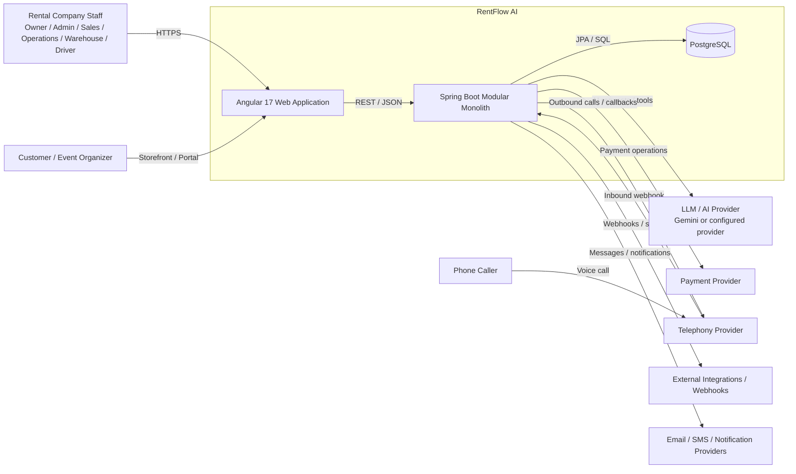

### Architectural principle

The Spring Boot application is the **authoritative business layer**. External providers and AI services assist the platform, but they do not bypass domain validation, tenant isolation, authorization, inventory rules, booking rules, financial calculations, or payment controls.

---

## 3. High-Level Container Architecture

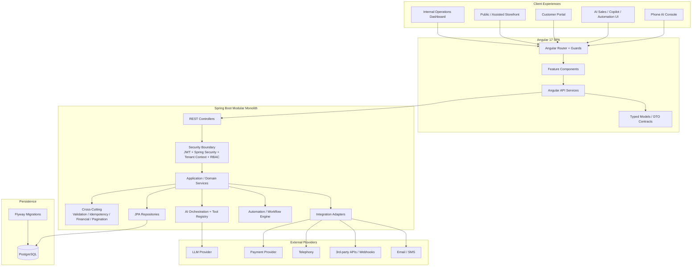

---

## 4. Backend Module Map

The backend currently contains the following top-level functional packages:

`ai`, `aisales`, `analytics`, `auth`, `automation`, `calendar`, `claims`, `common`, `crm`, `delivery`, `event`, `icp`, `integration`, `inventory`, `invoice`, `notification`, `payment`, `permission`, `phone`, `portal`, `rentalrequest`, `returns`, `role`, `security`, `tenant`, `user`, `warehouse`, and `workflow`.

### Backend logical module diagram

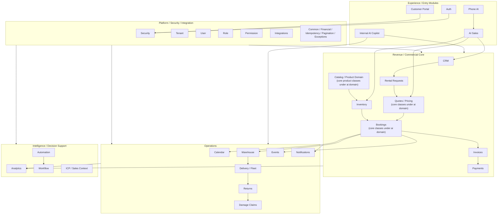

---

## 5. Module-by-Module Feature Overview

| Module | Main responsibility | Representative features |
|---|---|---|
| **auth** | Staff authentication | Login, password verification, JWT issuance, authentication services, rate-limit integration |
| **security** | Security enforcement | JWT filter, authenticated principal, security context, tenant context, security headers, startup safety checks, SSRF protection |
| **tenant** | Multi-tenant boundary | Tenant identity and tenant-scoped behavior |
| **user / role / permission** | Identity and access model | Users, roles, role assignment, permissions, RBAC enforcement |
| **crm** | Sales pipeline and customer relationship management | Leads, inquiries, pipeline stages, follow-ups, customer context |
| **rentalrequest** | Incoming rental demand | Rental request capture and handoff into sales/quote workflows |
| **event** | Event/customer rental context | Event records and event-linked rentals |
| **inventory** | Stock, reservation, availability support | Inventory units/state, reservation, conflict checks, availability support |
| **calendar** | Time-based operational view | Rental calendar, conflict view, driver/warehouse/vehicle/inventory calendars |
| **invoice** | Billing | Invoice lifecycle, balances, line items, customer billing |
| **payment** | Payment transaction domain | Payment recording, references, idempotency/integrity checks, provider-facing payment operations |
| **warehouse** | Fulfillment | Pick lists, pack/load operations, fulfillment state |
| **delivery** | Delivery and fleet operations | Delivery scheduling, routes, drivers, vehicles, dispatch |
| **returns** | Return processing | Check-in, return workflow, inspection handoff |
| **claims** | Damage and repair workflow | Damage claim creation, repair/damage handling, customer claim visibility |
| **portal** | Customer self-service | Customer authentication, dashboard, quote/booking/invoice/claim access, portal AI support |
| **notification** | Customer/staff communication | Notification models, event listeners, providers, delivery services |
| **integration** | External system connectivity | API keys/connectors, webhooks, sync services, integration security |
| **analytics** | Business reporting | Revenue, quote, utilization, customer/product/booking profitability and operational analytics |
| **aisales** | Customer-facing AI-assisted sales | Conversational discovery, lead capture, product/availability assistance, draft quote workflow, escalation |
| **ai** | Internal AI/copilot and core rental domain services | Copilot orchestration, providers, tools, core customer/product/quote/booking services and models |
| **automation** | Proactive recommendations/actions | Signal detection, recommendations, approval-oriented action dispatch |
| **workflow** | Workflow coordination | Business workflow execution/demos/coordination |
| **phone** | Voice/telephony foundation | Inbound call flow, provider abstraction, call sessions, voice AI support, handoff |
| **icp** | Ideal customer profile context | ICP profile and sales targeting context |
| **common** | Shared platform utilities | Exception handling, financial precision, idempotency, pagination, health/common configuration |

> Note: Some original core rental entities and services such as products, customers, quotes, and bookings are currently located under the broad `com.rentflow.ai` package. Functionally they are part of the commercial core even though the package name reflects the project's earlier evolution.

---

## 6. Frontend Architecture

The Angular application provides several experiences from a common SPA:

### Major frontend areas

- Internal dashboard
- Customer and CRM screens
- Leads
- Events
- Storefront / rentals
- Quotes
- Bookings
- Calendar and conflict dashboards
- Warehouse
- Delivery / routes / drivers
- Returns
- Damage claims
- Invoices / payments
- Integrations
- Analytics
- AI Sales
- AI Copilot
- Automation approvals/recommendations
- Phone AI
- Customer portal
- User/role management

### Frontend component flow

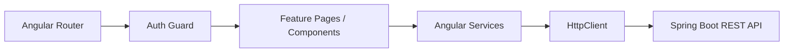

### UX surfaces

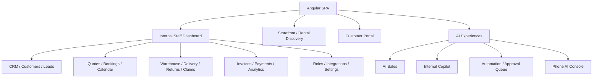

---

## 7. Core Rental Lifecycle

```mermaid
flowchart LR
    Lead["Lead / Inquiry"] --> Request["Rental Request"]
    Request --> Customer["Customer / Event"]
    Customer --> Quote["Quote"]
    Quote --> Availability{"Availability<br/>Valid?"}
    Availability -- No --> Alternative["Alternative inventory / dates"]
    Alternative --> Quote
    Availability -- Yes --> Approval["Quote Approval / Acceptance"]
    Approval --> Booking["Confirmed Booking"]
    Booking --> Reservation["Inventory Reservation"]
    Reservation --> Warehouse["Pick / Pack / Load"]
    Warehouse --> Delivery["Delivery / Pickup"]
    Delivery --> Active["Rental In Progress"]
    Active --> Return["Return / Check-In"]
    Return --> Inspect{"Damage?"}
    Inspect -- No --> Close["Close Rental"]
    Inspect -- Yes --> Claim["Damage Claim / Repair"]
    Claim --> Invoice["Invoice / Adjustment"]
    Close --> Invoice
    Invoice --> Payment["Payment / Balance"]
    Payment --> Complete["Completed"]
```

### Important transactional rules

- Quote/booking operations are tenant-scoped.
- Booking conversion is designed to be idempotent.
- Inventory reservation is protected against conflicting concurrent operations.
- Financial values use decimal-safe handling.
- Payments use unique/idempotent references.
- Database constraints and indexes complement application validation.
- Production schema evolution is handled through Flyway.

---

## 8. Quote-to-Booking Sequence

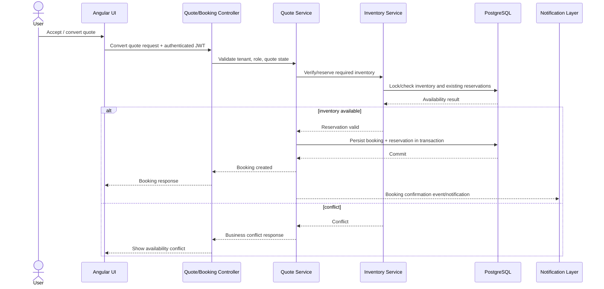

---

## 9. Warehouse, Delivery, Return, and Claim Flow

```mermaid
flowchart LR
    Booking["Confirmed Booking"]
    Pick["Warehouse Pick List"]
    Pack["Pack / Stage"]
    Load["Load List"]
    Route["Delivery Route"]
    Driver["Driver / Vehicle Assignment"]
    Deliver["Deliver / Customer Handoff"]
    Return["Return / Pickup"]
    Inspect["Inspection"]
    Claim["Damage Claim"]
    Repair["Repair / Cost"]
    Finance["Invoice / Payment Adjustment"]

    Booking --> Pick --> Pack --> Load --> Route --> Driver --> Deliver --> Return --> Inspect
    Inspect -->|No damage| Finance
    Inspect -->|Damage| Claim --> Repair --> Finance
```

---

## 10. Customer Portal Architecture

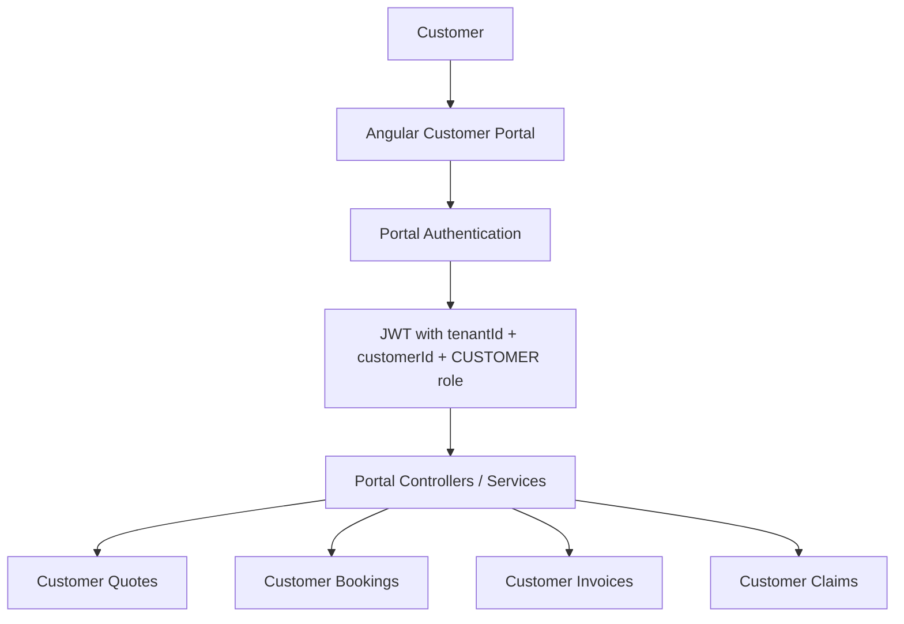

### Portal security boundary

Customer portal requests resolve both `tenantId` and `customerId` from the verified authenticated principal. Client-provided identity headers are not authoritative. Cross-customer or cross-tenant resource access is intentionally treated as not found where appropriate to reduce ID enumeration risk.

---

## 11. Authentication and Tenant Security Architecture

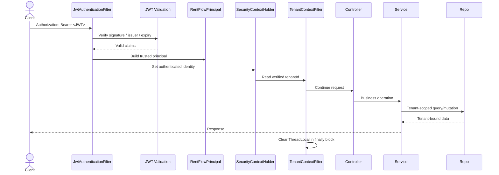

### Security layers

| Layer | Responsibility |
|---|---|
| Reverse proxy / TLS | HTTPS termination and transport security |
| Spring Security | Authentication and authorization |
| JWT validation | Signature, issuer, expiry, trusted claims |
| RentFlowPrincipal | Server-owned user/tenant/role/customer identity |
| TenantContext | Request-scoped tenant context |
| RBAC | OWNER / ADMIN / SALES / OPERATIONS / WAREHOUSE / DRIVER / CUSTOMER access rules |
| Repository/service scoping | `tenantId` included in business data access |
| IDOR protection | Cross-tenant/customer identifiers cannot escape authenticated scope |
| Security headers | CSP, HSTS, frame/content type/referrer policies |
| SSRF validation | Restricts unsafe outbound callback/webhook targets |
| Rate limiting | Protects sensitive public/login/AI endpoints |
| Validation | Request, financial, and domain invariant checks |

---

## 12. AI Architecture

AI capabilities are split into customer-facing sales assistance and internal decision support.

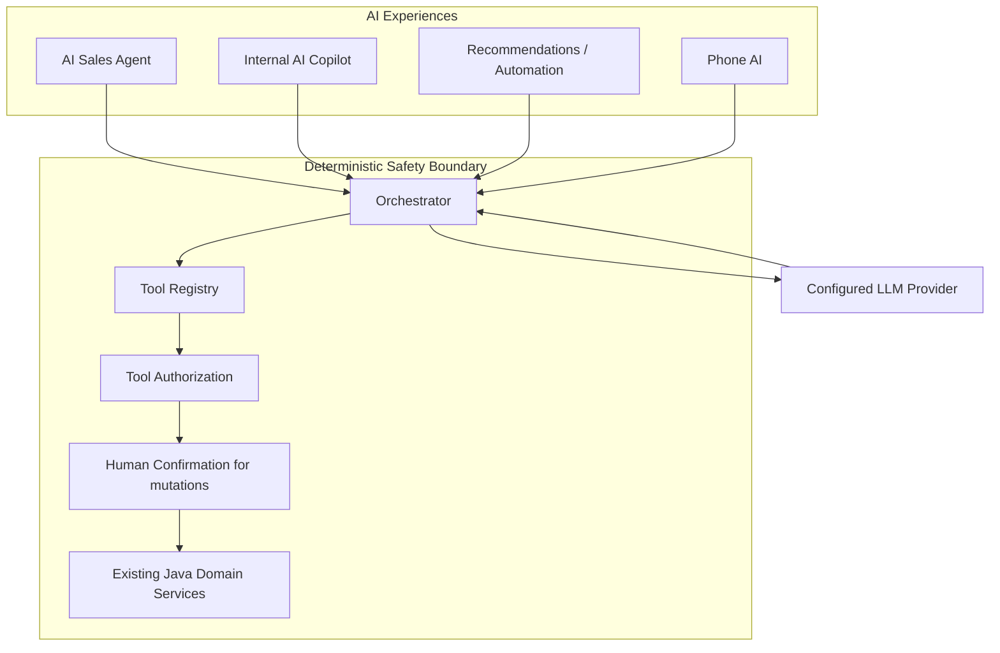

### AI Sales Agent

Representative capabilities:

- Conversational customer discovery
- Rental requirement capture
- Product / availability assistance
- Lead creation
- Draft quote preparation
- Conversation tracking
- Escalation to a human
- Safe tool invocation through Java services

### Internal AI Copilot

Representative capabilities:

- Natural-language business questions
- Operational search
- Business context summarization
- Explainable analytics
- Tool-backed actions
- Human confirmation before important state mutation

### Automation / Recommendations

Representative capabilities:

- Business signal detection
- Recommendation generation
- Approval queue
- Rule evaluation
- Safe action dispatch
- Idempotency / tenant-bound execution

### Phone AI

Representative capabilities:

- Telephony-provider abstraction
- Inbound call session handling
- Voice sales flow foundation
- Recording/transcription concepts
- Human handoff
- Explicit prohibition on collecting raw credit-card details over voice

### Critical AI principle

**The LLM is not the database and is not the transaction engine.** All authoritative mutations must pass through deterministic Spring services and normal security/business rules.

---

## 13. Analytics Architecture

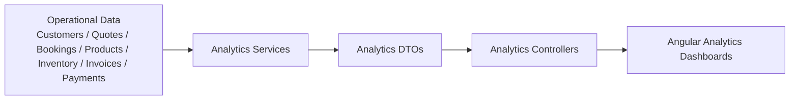

Current frontend/reporting areas indicate coverage for:

- Revenue analytics
- Quote analytics
- Utilization analytics
- Customer analytics
- Product profitability
- Booking profitability
- Operational analytics

Analytics should remain tenant-scoped and should not bypass normal data isolation merely because it is aggregate/reporting functionality.

---

## 14. Integration Architecture

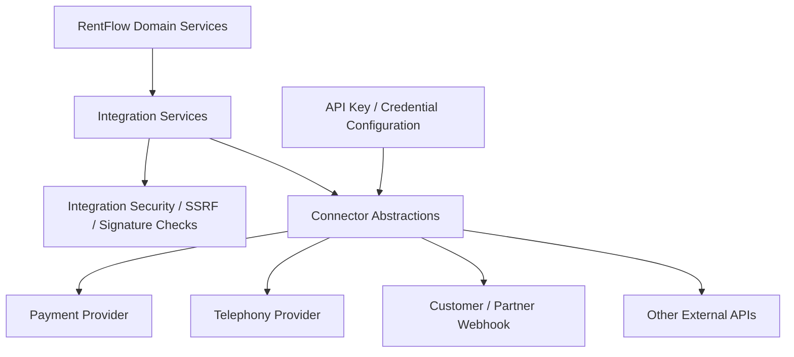

### Integration rules

- Credentials must be externalized from source code.
- Outbound webhook URLs must be SSRF-validated.
- Inbound provider webhooks should use signature verification.
- Provider-specific logic should remain behind adapters/services.
- Retries must respect idempotency.
- AI/provider unavailability must not prevent basic rental operations.

---

## 15. Notification Architecture

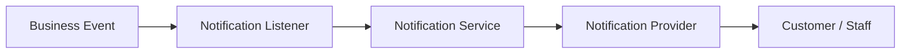

Notification scenarios can include quote updates, booking confirmations, fulfillment events, delivery updates, returns, claim changes, payment events, and operational alerts.

The go-live roadmap proposes strengthening this model with a **transactional outbox + background dispatcher** so request transactions do not depend on immediate external notification delivery.

---

## 16. Database Architecture

### Persistence strategy

- PostgreSQL is the intended production database.
- JPA/Hibernate provides ORM and repository access.
- Flyway owns production schema migration.
- Hibernate production mode validates schema rather than treating ORM auto-DDL as the migration mechanism.
- Database constraints complement Java validation.
- Tenant-scoped indexes support the primary SaaS access patterns.

### Simplified domain relationship view

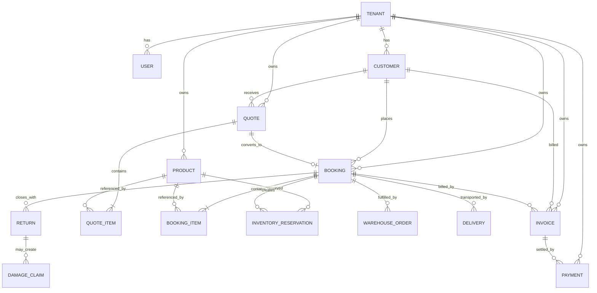

> The ER diagram is intentionally conceptual. The repository contains a wider entity model than shown here.

---

## 17. Cross-Cutting Platform Components

### Idempotency

Used to prevent duplicate business effects when a client/provider retries the same logical request. This is especially important for:

- Quote-to-booking conversion
- Booking checkout
- Payments
- External webhooks
- Future asynchronous dispatch

### Financial accuracy

Shared financial logic should continue to:

- Use decimal-safe numeric types
- Avoid floating-point money calculations
- Validate nonnegative/positive domain invariants
- Preserve consistent tax/subtotal/total/balance calculations

### Pagination and query safety

Core listing endpoints use controlled pagination and sort allowlists, protecting the application from unbounded result sets and unsafe dynamic sort fields.

### Concurrency

Inventory and booking flows require transaction/locking behavior that prevents overbooking under concurrent requests. PostgreSQL should be the authoritative integration-test platform for these cases.

---

## 18. Deployment Architecture — Current Direction

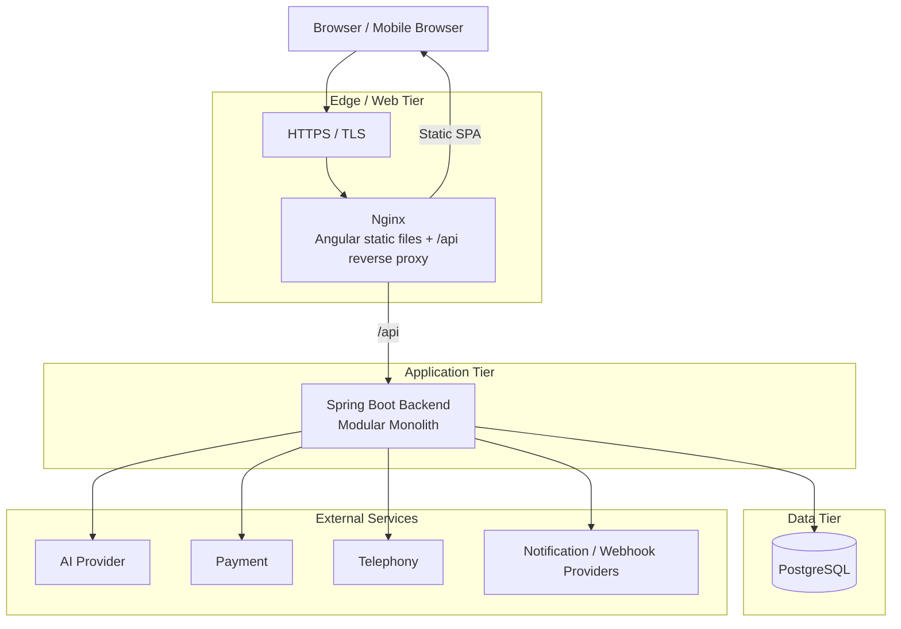

### Recommended initial production topology

For early production, the simplest sensible topology is:

**Angular SPA → Nginx → Spring Boot modular monolith → PostgreSQL**

Add Redis, dedicated workers, message brokers, multiple services, or orchestration platforms only when measured scale/reliability requirements justify them.

---

## 19. Local / Container Development Topology

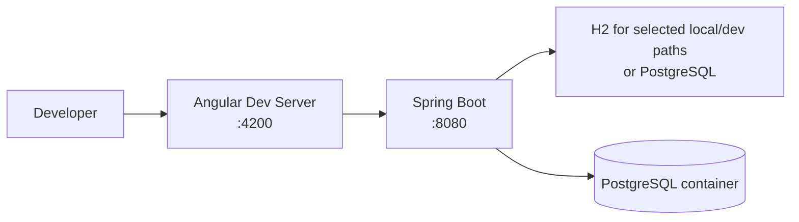

For production-representative verification, PostgreSQL should be preferred over H2, particularly for locking, constraints, indexing, Flyway, and concurrency behavior.

---

## 20. Security Trust Boundaries

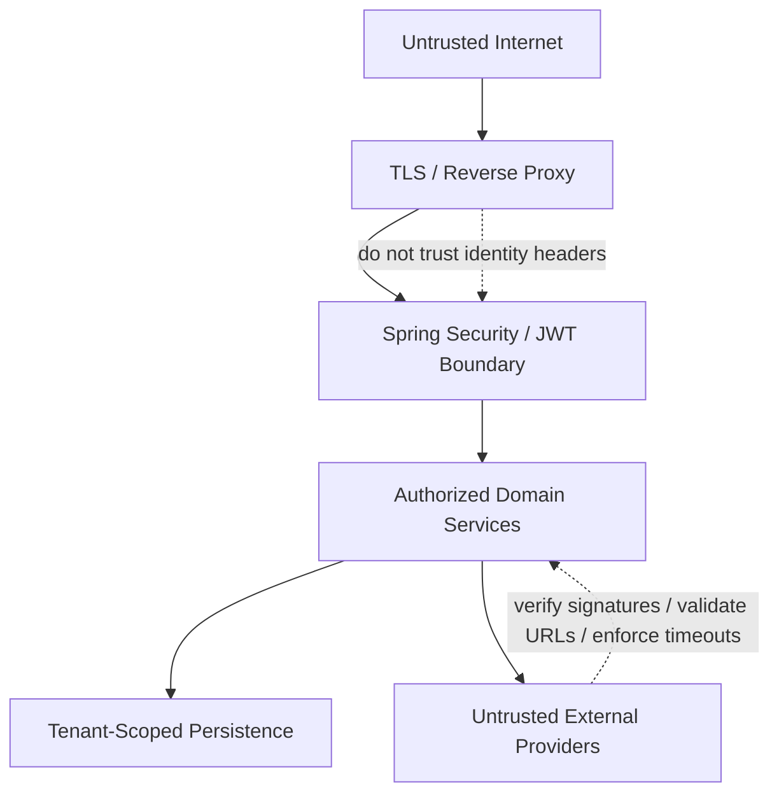

### Trust rules

1. Browser headers do not define tenant identity.
2. JWT claims are used only after cryptographic verification.
3. Customer ID for portal access is server-derived from the verified principal.
4. Database queries remain tenant-scoped even after controller authorization.
5. External callbacks are untrusted until verified.
6. AI output is untrusted until validated and authorized through deterministic tools.
7. Sensitive state changes should be auditable.

---

## 21. Major Feature Map by Persona

### Owner / Admin

- Executive dashboard
- Users, roles, permissions
- Catalog/pricing
- Inventory visibility
- Sales/booking oversight
- Finance and profitability
- Integrations
- AI Copilot
- Automation approvals
- Operational monitoring

### Sales

- Leads and CRM
- Customer 360
- Rental requests
- Availability discovery
- Quotes
- Booking conversion
- AI Sales assistance
- Follow-ups

### Operations

- Booking calendar
- Conflict management
- Inventory scheduling
- Delivery coordination
- Returns
- Claims
- Cross-functional operational dashboard

### Warehouse

- Pick lists
- Pack/stage
- Load lists
- Inventory status
- Return intake

### Driver

- Assigned routes
- Delivery calendar
- Vehicle/route information
- Delivery completion/handoff

### Customer

- Storefront discovery
- Quote visibility
- Booking visibility
- Invoice/payment information
- Claim visibility
- Customer portal
- Assisted AI/phone experiences where enabled

---

## 22. Detailed Domain Interaction Map

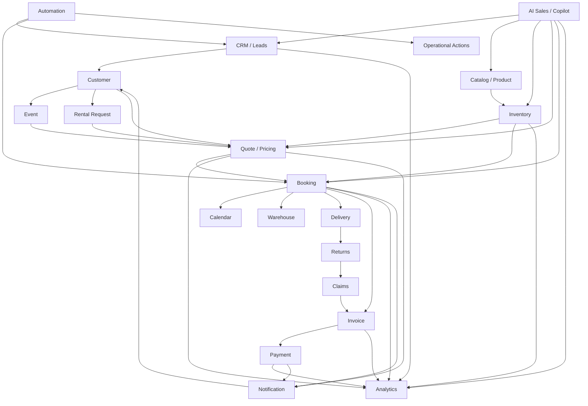

---

## 23. Package-Level Architectural Guidance

The current modular monolith is the right fit for near-term go-live. As the codebase evolves, module boundaries should become clearer without immediately creating services.

### Recommended dependency direction

```text
Controllers
    ↓
Application / Domain Services
    ↓
Domain Models + Policies
    ↓
Repositories / Provider Ports
    ↓
JPA / External Provider Adapters

Cross-cutting:
Security • Tenant Context • Validation • Financial • Idempotency • Observability
```

### Avoid

- Controller-to-repository direct access for complex business actions
- Cross-module repository access everywhere
- Circular service dependencies
- AI code directly writing JPA entities
- Provider SDK types leaking deeply into the domain
- Global/unscoped repositories in tenant domains
- Premature physical microservice separation

---

## 24. Current Architecture vs Go-Live Hardening Roadmap

The repository already contains broad business functionality and significant security/database hardening. The Day 40–70 roadmap focuses on converting this into an operationally reliable production system.

| Area | Current architecture direction | Go-live hardening focus |
|---|---|---|
| Deployment | Docker/Spring/Angular/PostgreSQL direction | Repair env alignment, frontend container, immutable delivery |
| Database | Flyway + PostgreSQL + constraints/indexes | Clean bootstrap, PostgreSQL integration CI, restore proof |
| Security | JWT, tenant context, RBAC, IDOR hardening, headers, SSRF | Account lifecycle, refresh rotation, audit trail |
| CI/CD | Repository has application/tests | Mandatory backend/frontend/security pipelines |
| Observability | Health/runbook concepts | Actuator, structured logs, Micrometer, alerts |
| Reliability | Idempotency and transactional controls exist | Provider resilience, webhook durability, outbox |
| Performance | Pagination/index work exists | Load tests, EXPLAIN plans, pool/JVM tuning |
| DR | Backup/restore documentation exists | Automated backups + real restore drill |
| AI | Sales/Copilot/automation/phone foundations | Feature flags, provider resilience, controlled rollout |
| Launch | Feature-rich application | Smoke suite, first-customer checklist, final go-live gate |

See: `docs/go-live-roadmap/` for the daily production-readiness implementation prompts.

---

## 25. Production Evolution Path

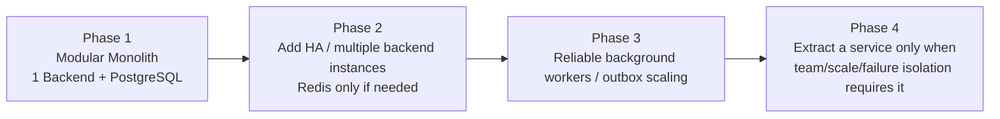

### Extraction criteria for future services

A module should become an independent service only when there is evidence for one or more of these:

- Independent scaling requirement
- Strong operational/failure isolation need
- Separate release cadence
- Clear data ownership boundary
- Different security/compliance boundary
- Separate team ownership
- Measured contention inside the monolith

Do not extract services merely because the codebase has many modules.

---

## 26. Architectural Strengths

1. Broad end-to-end rental lifecycle coverage
2. Modular package organization
3. Tenant-aware domain design
4. JWT/Spring Security foundation
5. Customer portal IDOR hardening
6. Database constraints and tenant-focused indexes
7. Idempotency and financial-integrity work
8. Inventory concurrency focus
9. Flyway schema management
10. AI tool safety approach with deterministic Java services
11. Separate operational areas for warehouse, delivery, returns, and claims
12. Analytics, CRM, and customer portal integrated with the same source of truth

---

## 27. Architectural Risks / Areas to Continue Hardening

1. The `ai` package currently contains both AI responsibilities and several core commercial-domain classes, so package boundaries should gradually be clarified.
2. Production deployment configuration must remain synchronized across Spring properties, Docker/hosting variables, and documentation.
3. Critical persistence/concurrency behavior should be continuously tested on PostgreSQL.
4. In-memory rate limiting is suitable only for a single-instance deployment; horizontally scaled deployments need a shared limiter or edge enforcement.
5. External providers need consistent timeout/retry/circuit-breaker policies.
6. Notifications/webhooks need durable asynchronous delivery for stronger reliability.
7. Account lifecycle features need production-level reset, verification, refresh/revocation, and auditability.
8. Backup instructions must be converted into automated backups and proven restoration.
9. Observability should evolve from health checks into logs, metrics, traces/correlation, and actionable alerting.
10. Optional AI features should be feature-flagged and fail independently of the rental transaction path.

These risks directly align with the Day 40–70 go-live roadmap.

---

## 28. Architecture Decision Summary

### ADR-1 — Keep a modular monolith

**Decision:** Maintain one Spring Boot deployable backend for initial go-live.

**Why:** The business requires strong transactions across quote, booking, inventory, payment, fulfillment, and return workflows. A monolith keeps consistency and operational cost lower while still allowing package-level modularity.

### ADR-2 — PostgreSQL is the production source of truth

**Decision:** Use PostgreSQL + Flyway for production persistence and schema change.

**Why:** Rental availability, locking, constraints, financial integrity, and tenant-scoped indexing need production-grade relational behavior.

### ADR-3 — Security context owns tenant identity

**Decision:** Resolve user, role, tenant, and customer scope from authenticated server-side identity.

**Why:** Client-provided tenant/customer headers are spoofable and cannot be trusted.

### ADR-4 — AI cannot bypass domain services

**Decision:** AI tools invoke deterministic Java services instead of directly mutating persistence.

**Why:** Business rules, authorization, idempotency, financial calculations, and inventory integrity must remain deterministic and auditable.

### ADR-5 — Defer distributed complexity

**Decision:** Do not add Kafka/microservices/Kubernetes by default.

**Why:** Current product scale does not justify the operational cost. Use PostgreSQL transactions/outbox and simple deployment first; evolve based on evidence.

---

## 29. Suggested Architecture Documentation Structure

```text
docs/
├── architecture/
│   └── rentflow-ai-architecture-overview.md   <-- this document
├── database/
├── finance/
├── inventory/
├── production/
├── go-live-roadmap/
├── ai-architecture.md
├── availability-engine.md
├── bookings.md
├── crm.md
├── customers.md
├── inventory.md
├── quotes.md
└── production-checklist.md
```

---

## 30. One-Page Architecture View

```mermaid
flowchart TB
    Users["Staff • Customers • Phone Callers"]

    subgraph UX["Angular Experiences"]
        Dashboard["Operations Dashboard"]
        Storefront["Storefront"]
        Portal["Customer Portal"]
        AIUX["AI Sales / Copilot / Automation / Phone AI"]
    end

    subgraph API["Spring Boot Modular Monolith"]
        SEC["JWT • Tenant • RBAC • Security"]
        SALES["CRM • Customer • Rental Request • Quote • Booking"]
        STOCK["Catalog • Inventory • Availability • Calendar"]
        OPS["Warehouse • Delivery • Returns • Claims"]
        FIN["Invoices • Payments • Analytics"]
        INTEL["AI Sales • Copilot • Automation • Workflow • Phone"]
        PLATFORM["Notifications • Integrations • Common Controls"]
    end

    PG[("PostgreSQL + Flyway")]
    Providers["AI • Payment • Telephony • Webhook • Notification Providers"]

    Users --> UX
    UX --> SEC
    SEC --> SALES
    SEC --> STOCK
    SEC --> OPS
    SEC --> FIN
    SEC --> INTEL

    SALES <--> STOCK
    SALES --> OPS
    SALES --> FIN
    OPS --> FIN
    SALES --> INTEL
    STOCK --> INTEL
    FIN --> INTEL
    PLATFORM --> Providers

    SALES --> PG
    STOCK --> PG
    OPS --> PG
    FIN --> PG
    INTEL --> PG
    PLATFORM --> PG
```

---

## 31. Summary

RentFlow AI should be viewed as **one integrated rental operating system with strong logical modules**, rather than a collection of microservices.

The central architectural flow is:

```text
Customer / Staff Experience
        ↓
Angular SPA
        ↓
Spring Security + Verified Tenant Context
        ↓
Domain Modules
CRM → Quote → Booking → Inventory → Warehouse → Delivery → Return → Claims
                     ↓
               Invoice → Payment
        ↓
PostgreSQL / Flyway
```

AI, automation, telephony, and external integrations sit around this core and must always enter through authenticated, validated, deterministic application services.

For go-live, the priority is not adding more architectural layers. The priority is making this modular monolith **repeatable to deploy, secure, observable, resilient, recoverable, and easy to operate**.
