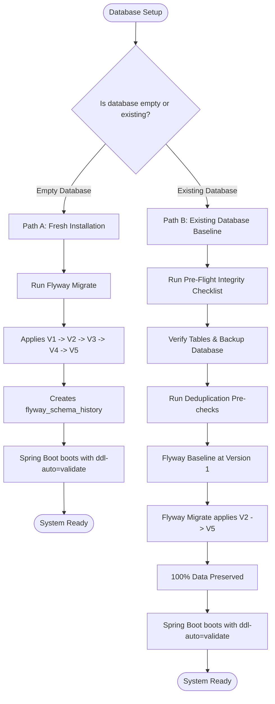

# Day 38: Flyway Database Migration & Production-Safe Schema Management

## 1. Executive Summary & Architecture

RentFlow AI uses **Flyway** paired with **PostgreSQL** and **Spring Boot 3.2.4** to manage enterprise-grade, version-controlled database schema migrations.

### Core Architectural Principles
1. **Source of Truth**: Versioned SQL scripts in `src/main/resources/db/migration/` are the authoritative source of truth for the database schema.
2. **Strict Validation**: In production (`prod` profile), `spring.jpa.hibernate.ddl-auto=validate` enforces zero schema drift between JPA `@Entity` definitions and the live PostgreSQL schema.
3. **P0 Data Safety**: Destructive DDL operations (`DROP TABLE`, `DROP DATABASE`, `TRUNCATE`, `DROP SCHEMA CASCADE`) are strictly prohibited.
4. **Controlled Dual-Path Onboarding**:
   - **Path A (Fresh Install)**: Automatically applies `V1` through `V5` on empty schemas.
   - **Path B (Existing Database Baseline)**: Safely baselines existing Day 30 schemas at version `1` without dropping data, then applies incremental migrations `V2` through `V5`.
5. **Pre-Check Guardrails**: Migrations introducing unique constraints (e.g., payment references, booking idempotency) run pre-check verification to identify and resolve duplicates prior to applying DDL.

---

## 2. Configuration Matrix

### Development Profile (`application.properties`)
```properties
spring.application.name=RentFlow AI Backend
server.port=8080

# In-memory H2 database for local velocity
spring.datasource.url=jdbc:h2:mem:rentflow;DB_CLOSE_DELAY=-1
spring.datasource.driverClassName=org.h2.Driver
spring.datasource.username=sa
spring.datasource.password=
spring.jpa.database-platform=org.hibernate.dialect.H2Dialect
spring.h2.console.enabled=true
spring.jpa.hibernate.ddl-auto=update
spring.jpa.show-sql=true
```

### Production Profile (`application-prod.properties`)
```properties
spring.application.name=RentFlow AI Backend (Production)
server.port=${PORT:8080}

# Database (PostgreSQL)
spring.datasource.url=${DATABASE_URL:${SPRING_DATASOURCE_URL:jdbc:postgresql://localhost:5432/rentflow}}
spring.datasource.username=${DATABASE_USERNAME:${SPRING_DATASOURCE_USERNAME:postgres}}
spring.datasource.password=${DATABASE_PASSWORD:${SPRING_DATASOURCE_PASSWORD:}}
spring.datasource.driver-class-name=org.postgresql.Driver

# Connection Pool Tuning (HikariCP)
spring.datasource.hikari.maximum-pool-size=${DB_POOL_MAX:20}
spring.datasource.hikari.minimum-idle=${DB_POOL_MIN_IDLE:5}
spring.datasource.hikari.idle-timeout=30000
spring.datasource.hikari.connection-timeout=20000
spring.datasource.hikari.max-lifetime=1800000
spring.datasource.hikari.pool-name=RentFlowProdHikariPool

# Flyway Database Migration
spring.flyway.enabled=true
spring.flyway.locations=classpath:db/migration
spring.flyway.baseline-on-migrate=false
spring.flyway.validate-on-migrate=true
spring.flyway.table=flyway_schema_history

# JPA / Hibernate Validation
spring.jpa.database-platform=org.hibernate.dialect.PostgreSQLDialect
spring.jpa.hibernate.ddl-auto=${HIBERNATE_DDL_AUTO:validate}
spring.jpa.show-sql=false
spring.jpa.open-in-view=false
```

> [!IMPORTANT]
> `spring.flyway.baseline-on-migrate=false` is enforced in production to prevent unintended automatic baselining against an unverified or corrupted database state. Controlled baseline operations must be run explicitly.

---

## 3. Versioned Migration Catalog

All migration files are located under `backend/src/main/resources/db/migration/`:

| Version | File Name | Purpose | Scope / Key Elements |
|---------|-----------|---------|-----------------------|
| `V1` | `V1__initial_schema.sql` | Baseline Schema | 114 tables (112 JPA entities + 2 join tables: `app_user_roles`, `ai_conversation_tags`), primary keys, foreign keys, and indexes up to Day 30. |
| `V2` | `V2__security_and_auth_hardening.sql` | Security & Auth | Composite multi-tenant indexes on `refresh_tokens`, `security_audit_logs`, and user lookups. |
| `V3` | `V3__payment_idempotency_constraints.sql` | Financial Integrity | Unique constraint `uq_payment_tenant_transaction_reference` on `(tenant_id, transaction_reference)` and payment lookup index `idx_payment_tenant_status`. |
| `V4` | `V4__booking_checkout_idempotency.sql` | Booking & Lead Idempotency | Adds missing columns if necessary and enforces: `uq_rental_req_tenant_idempotency`, `uq_crm_lead_tenant_rental_req`, `uq_booking_tenant_quote`, and quote idempotency indexes. |
| `V5` | `V5__financial_precision_and_inventory_constraints.sql` | Inventory Integrity | Unique constraint `uk_wh_stock_product_warehouse` on `warehouse_stock(product_id, warehouse_id)`, check constraint `chk_products_quantity_owned_nonneg` (`quantity_owned >= 0`), and `idx_inv_res_product_dates`. |

---

## 4. Initialization Workflows



### Path A: New / Empty Database Installation
1. Provision empty PostgreSQL database and user:
   ```sql
   CREATE DATABASE rentflow;
   CREATE USER rentflow_user WITH ENCRYPTED PASSWORD 'StrongSecretPassword!';
   GRANT ALL PRIVILEGES ON DATABASE rentflow TO rentflow_user;
   ```
2. Start application with `spring.profiles.active=prod`.
3. Flyway detects an empty schema, applies `V1__initial_schema.sql` through `V5__financial_precision_and_inventory_constraints.sql`, and records migration metadata in `flyway_schema_history`.
4. Hibernate validates the schema against the JPA entity domain model and boots cleanly.

### Path B: Existing Database Baseline Procedure (Option A Rationale)
When an existing database already contains tables created prior to Flyway introduction:
1. **Pre-flight Integrity Audit**:
   - Verify existing schema matches Day 30 baseline table structures.
   - Run a physical database backup (`pg_dump`).
2. **Deduplication Pre-Checks**:
   Before applying `V3`, `V4`, and `V5` unique constraints, verify no duplicate records exist:
   ```sql
   -- Verify payment transaction references
   SELECT tenant_id, transaction_reference, COUNT(*)
   FROM payments
   WHERE transaction_reference IS NOT NULL
   GROUP BY tenant_id, transaction_reference
   HAVING COUNT(*) > 1;

   -- Verify rental request idempotency
   SELECT tenant_id, idempotency_key, COUNT(*)
   FROM rental_requests
   WHERE idempotency_key IS NOT NULL
   GROUP BY tenant_id, idempotency_key
   HAVING COUNT(*) > 1;

   -- Verify warehouse stock per product
   SELECT product_id, warehouse_id, COUNT(*)
   FROM warehouse_stock
   WHERE product_id IS NOT NULL AND warehouse_id IS NOT NULL
   GROUP BY product_id, warehouse_id
   HAVING COUNT(*) > 1;
   ```
3. **Execute Baseline**:
   Baseline the existing schema at version `1`:
   ```bash
   flyway -url=jdbc:postgresql://localhost:5432/rentflow \
          -user=rentflow_user -password=StrongSecretPassword! \
          -baselineVersion=1 \
          -baselineDescription="Initial Baseline" \
          baseline
   ```
   Or via Spring Boot CLI / temporary environment property:
   `SPRING_FLYWAY_BASELINE_ON_MIGRATE=true` with `SPRING_FLYWAY_BASELINE_VERSION=1`.
4. **Apply Pending Migrations**:
   Run `flyway migrate` or boot the application. Flyway skips `V1` and safely applies `V2`, `V3`, `V4`, and `V5` in sequence.
5. **Data Preservation**:
   All business records in all 114 tables remain untouched.

---

## 5. Production-Safe Schema Evolution Rules

When adding future migrations (`V6`, `V7`, ...), engineers must adhere to the following rules:

### 1. Expand and Contract Pattern
- **Never rename or drop columns** in a single release.
- **Phase 1 (Expand)**: Add the new column as nullable or with default. Update backend to write to both old and new columns.
- **Phase 2 (Backfill)**: Backfill data from old column to new column.
- **Phase 3 (Contract)**: Update backend to read only from new column. Drop or deprecate old column in a future migration.

### 2. Non-blocking Index Creation
In PostgreSQL, creating indexes on large production tables blocks writes unless executed concurrently. Standalone operational scripts should use:
```sql
CREATE INDEX CONCURRENTLY IF NOT EXISTS idx_name ON table_name (column_name);
```

### 3. Adding NOT NULL Columns
- Never add a `NOT NULL` column without a `DEFAULT` value to a table with existing rows:
```sql
-- Safe
ALTER TABLE products ADD COLUMN IF NOT EXISTS warranty_months INTEGER NOT NULL DEFAULT 12;
```

### 4. Adding UNIQUE Constraints
- Always run pre-check validation queries to identify duplicates before creating unique constraints.
- In migration scripts, ensure idempotent execution syntax (`IF NOT EXISTS` or exception-safe PL/pgSQL blocks).

---

## 6. Operational Runbooks

### Runbook 1: Pre-Migration Backup Requirement
Before executing any migration in staging or production:
```bash
pg_dump -h localhost -p 5432 -U rentflow_user -F c -b -v -f "/var/backups/rentflow_pre_migration_$(date +%Y%m%d_%H%M%S).dump" rentflow
```

### Runbook 2: Checksum Mismatch Resolution
If a migration script was altered after being applied:
1. **Prohibition**: Never edit applied migration files in production!
2. **If script was modified in error**:
   - Revert the SQL file to match the checksum recorded in `flyway_schema_history`.
3. **If comment/whitespace change only**:
   - Run `flyway repair` to recalculate checksums in `flyway_schema_history`:
     ```bash
     flyway -url=... -user=... -password=... repair
     ```
4. **If DDL change is needed**:
   - Create a new migration (e.g., `V6__fix_constraint.sql`) instead of modifying an applied migration.

### Runbook 3: Schema Drift Diagnosis
If the application fails to boot with `SchemaManagementException`:
```
org.hibernate.tool.schema.spi.SchemaManagementException: Schema-validation: missing column [...]
```
1. Inspect the error log to identify the missing column or type mismatch.
2. Determine which migration was missed or which JPA entity was modified without a corresponding migration script.
3. Author a new versioned migration (`V{N}__add_missing_column.sql`) and run `flyway migrate`.

---

## 7. Verification & Test Evidence

The migration architecture has been validated through an automated integration test suite:

### Test Classes in `com.rentflow.migration`
1. **`FlywayFreshDatabaseTest`**:
   - Validates fresh installation on empty database.
   - Verifies sequential execution of `V1` through `V5`.
   - Asserts all core tables, constraints, and indexes exist.
   - Asserts behavioral enforcement of constraints (e.g. duplicate payment reference rejection).
2. **`FlywayExistingDatabaseTest`**:
   - Simulates pre-existing Day 30 database with live business records.
   - Baselines schema at `V1`.
   - Executes pending migrations `V2` through `V5`.
   - Verifies 100% data preservation across all tables.
3. **`FlywayMigrationValidationTest`**:
   - Tests repeatable startup idempotency (0 migrations re-executed on second run).
   - Detects and rejects checksum mismatches.
   - Verifies duplicate payment pre-check detection.
   - Validates failure and abort behavior on invalid SQL.
4. **`FlywaySchemaValidationTest`**:
   - Boots Spring Boot `ApplicationContext` with Flyway applied and `spring.jpa.hibernate.ddl-auto=validate`.
   - Confirms 0 schema drift errors across all 112 JPA entities.

### Verification Summary
- **Migration Suite**: 10 of 10 tests passed (0 failures, 0 errors).
- **Day 31–37 Regression Suite**: 63 of 63 tests passed (0 failures, 0 errors).
- **Frontend Test Suite**: 18 of 18 Karma tests passed.
- **Data Safety**: Zero destructive DDL commands in all migration files.
