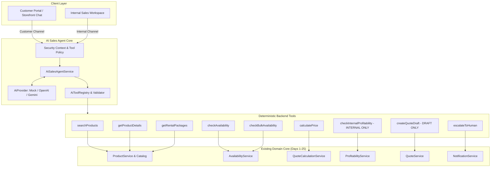

# Day 26 — AI Sales Agent Architecture & Specification

## Conversational Rental Discovery, Tool Calling, Availability, Profit-Aware Quote Drafting & Human Approval

---

## 1. Objective & Architectural Overview

The RentFlow AI Sales Agent provides an autonomous conversational discovery and quote preparation layer for rental prospects and existing customers across storefronts, customer portals, and internal sales workflows. 

### Critical Safety Principles
1. **Source of Truth Decoupling**: The Large Language Model (LLM) acts solely as an orchestrator and conversational translator. It is **never** the database, pricing engine, inventory calendar, or contracting authority.
2. **Deterministic Service Enforcement**: All product details, date-aware availability, pricing line items, taxes, and margins are computed exclusively by backend Java domain services.
3. **No Autonomous Commercial Commitments**: The AI creates quotes strictly in `DRAFT` status. A human sales representative must review and approve before quotes are commercially issued to clients.
4. **Tenant Isolation & Zero PII Leakage**: Tenant context is resolved strictly from authenticated user/customer sessions (`SecurityUtils`), never from LLM prompt inputs. Internal cost structures, supplier pricing, and profit margins are blocked from customer contexts via tool authorization boundaries.
5. **Provider Agnostic & Offline Operation**: Complete local development and test suite runs deterministically with `AI_PROVIDER=mock`, requiring zero paid third-party API credentials.



---

## 2. Existing Architecture Findings & Reuse Assessment

### 2.1 Dependencies
- **Maven dependencies**: Spring Boot 3.2.4 Web, Data JPA, H2 runtime, Test. No external LLM dependencies (Spring AI or LangChain4j) are currently packaged. A lightweight, clean provider abstraction using native HTTP clients (`RestClient` / `HttpClient`) and standard Jackson object-mapping keeps the system flexible, robust, and zero-bloat.

### 2.2 Reusable Domain Core
| Domain Capability | Existing Class / Service | Reusability in Day 26 AI Sales Agent |
|---|---|---|
| **Catalog & Products** | `Product`, `ProductCategory`, `ProductRepository`, `ProductService` | Directly leveraged for customer-safe product metadata (names, dimensions, guest capacity, standard rental rates, images). |
| **Availability** | `AvailabilityService`, `InventoryReservationRepository` | Fully reused via `checkAvailability` and `checkBulkAvailability` tools. Prevents double-booking and checks turnaround buffer times. |
| **Pricing & Calculations** | `QuoteCalculationService` | Authoritative calculation of rental days multipliers (`PER_DAY`, `PER_EVENT`, `PER_WEEK`), discounts, delivery/setup fees, and sales tax. |
| **Profitability** | `ProfitabilityService` | Computes revenue, acquisition depreciation, turn labor costs, and gross margin percentage for internal sales evaluation. |
| **Quote Management** | `QuoteService`, `QuoteRepository`, `QuoteItemRepository` | Direct creation of `DRAFT` quotes with unique sequential numbers (`QUO-000101`). |
| **Inquiries & Leads** | `Lead`, `LeadService`, `LeadRepository` | Seamless linkage between sales conversations and CRM leads. |
| **Notifications & Audit** | `NotificationService` | Dispatches in-app, SMS, or email alerts for human escalations, quote review readiness, and margin exceptions. |
| **Tenant Isolation & RBAC** | `SecurityUtils`, `PermissionCode`, `Role` | Guarantees all tool operations run under the authenticated tenant ID and checks role capabilities. |

---

## 3. AI Sales Agent Architecture

### 3.1 Domain Model (`com.rentflow.aisales.model`)
1. **`AiSalesConversation`**: Tracks active dialogue, status (`ACTIVE`, `WAITING_FOR_CUSTOMER`, `WAITING_FOR_AGENT`, `WAITING_FOR_HUMAN`, `QUOTE_DRAFTED`, `COMPLETED`, `CLOSED`, `ESCALATED`), channel (`INTERNAL`, `CUSTOMER_PORTAL`, `STOREFRONT`, `WEB_CHAT`), assigned sales user, customer/lead ID, and tenant ID.
2. **`AiSalesMessage`**: Individual messages with sender type (`CUSTOMER`, `AI`, `SALES_USER`, `SYSTEM`), message type (`TEXT`, `TOOL_CALL`, `TOOL_RESULT`, `SYSTEM_EVENT`), content, and sanitized JSON payload for tools.
3. **`RentalInquiry`**: Structured state capturing event type, guest count, event date, rental start/end, delivery city/address, preferred table/chair styles, budget, and missing field tracking.
4. **`AiEscalation`**: Escalation ticket with reason (`CUSTOMER_REQUEST`, `AI_UNCERTAIN`, `PRICING_EXCEPTION`, `LOW_MARGIN`, `UNAVAILABLE_INVENTORY`, `COMPLEX_EVENT`), priority, summary, assigned sales rep, and resolution lifecycle.
5. **`AiPromptTemplate`**: Versioned prompt configurations (`SALES_SYSTEM`, `INQUIRY_EXTRACTION`, `QUOTE_ASSISTANCE`, `RESPONSE_GUARDRAIL`).
6. **`AiUsageRecord`**: Tracks provider, model, tokens, latency ms, operation, and estimated cost for observability.
7. **`AiFeedback`**: Internal staff and customer feedback tracking (`Helpful`, `Not Helpful`, reasons).

---

## 4. Provider Abstraction & Mock AI Provider

### 4.1 Interface `AiProvider`
```java
public interface AiProvider {
    String getProviderName();
    AiChatResponse chat(AiChatRequest request);
    <T> T structuredResponse(AiChatRequest request, Class<T> responseType);
    boolean isHealthy();
}
```

### 4.2 Mock AI Provider (`MockAiProvider`)
- Deterministic heuristic engine simulating realistic conversational discovery.
- Supports conversational flows:
  - Detects event type, guest count, and dates from natural language.
  - Automatically identifies missing parameters (delivery location, table preference) and poses polite questions.
  - Triggers `searchProducts`, `checkAvailability`, `calculatePrice`, and `checkInternalProfitability`.
  - Generates DRAFT quotes when requirements are complete.
  - Handles edge cases: out-of-stock items, unknown products, low-margin warnings, customer requests for human assistance, and prompt injection attempts.

---

## 5. Controlled Tool Registry & Security Matrix

| Tool Name | Visibility | Mutating | Role Permission | Underlying Service |
|---|---|---|---|---|
| `searchProducts` | Customer & Internal | No | Public / Customer / Sales | `ProductRepository.search()` (Sanitized, no costs) |
| `getProductDetails` | Customer & Internal | No | Public / Customer / Sales | `ProductRepository.findByTenantIdAndId()` |
| `checkAvailability` | Customer & Internal | No | Public / Customer / Sales | `AvailabilityService.checkAvailability()` |
| `checkBulkAvailability`| Customer & Internal | No | Public / Customer / Sales | `AvailabilityService.checkAvailability()` (Batched) |
| `getRentalPackages` | Customer & Internal | No | Public / Customer / Sales | Curated package definitions from catalog |
| `calculatePrice` | Customer & Internal | No | Public / Customer / Sales | `QuoteCalculationService.calculate()` |
| `checkInternalProfitability` | **INTERNAL ONLY** | No | `SALES`, `ADMIN`, `OWNER` | `ProfitabilityService` |
| `createQuoteDraft` | Internal (or via AI approval flow)| Draft Mutation | `SALES`, `ADMIN`, `OWNER` | `QuoteService.createQuote(..., DRAFT)` |
| `escalateToHuman` | Customer & Internal | Draft Mutation | Any | `NotificationService` & `AiEscalation` |

---

## 6. Prompt Injection Defense & Data Boundaries
1. **Context Isolation**: Customer session tools are strictly restricted; the tool registry will reject any customer invocation of `checkInternalProfitability` with `PERMISSION_DENIED`.
2. **Untrusted Data as Values**: Product names, user inputs, and notes are escaped and passed as structured JSON parameters, never concatenated into system prompt directives.
3. **Tenant Context Enforced by Server**: `tenantId` is stamped by `SecurityUtils` on the backend and cannot be spoofed by LLM responses.

---

## 7. Human Review & Commercial Quote Lifecycle
1. When the customer inquiry reaches completeness, the AI calls `createQuoteDraft` which registers a quote with status `DRAFT`.
2. The AI Sales Agent sets the conversation status to `WAITING_FOR_HUMAN` and posts an internal summary (including estimated margin).
3. The sales rep navigates to `/ai-sales/quotes/:id/review` to inspect line items, availability, margins, and notes.
4. Upon clicking **Approve & Send**, the quote status transitions from `DRAFT` to `PENDING` / `SENT` via standard `QuoteService.sendQuote()`.

---

## 8. Angular UI Architecture
- **AI Sales Dashboard** (`/ai-sales`): Real-time metrics (Active Conversations, Inquiries, Pending Review, Escalations, AI-Assisted Conversions).
- **Conversations List** (`/ai-sales/conversations`): Filterable table of all chats with channel, intent, status, and assigned sales rep.
- **Conversation Detail** (`/ai-sales/conversations/:id`): Split-pane interface showing the chat transcript, structured inquiry state, recommended products, real-time availability, and internal profitability notes. Actions: *Take Over*, *Return to AI*, *Escalate*, *Create Quote*.
- **Quote Review Screen** (`/ai-sales/quotes/:id/review`): Detailed review screen for sales reps showing AI-recommended products, pricing breakdown, margin gauge, and one-click *Approve & Send*.
- **Customer Chat Widget** (`/portal/assistant` & storefront popup): Responsive chat widget allowing customers to inquire about party/wedding rentals, check availability, and receive draft recommendations.
- **AI Settings** (`/ai-sales/settings`): Admin panel for AI provider selection, model configuration, daily rate limits, and approval toggles.
