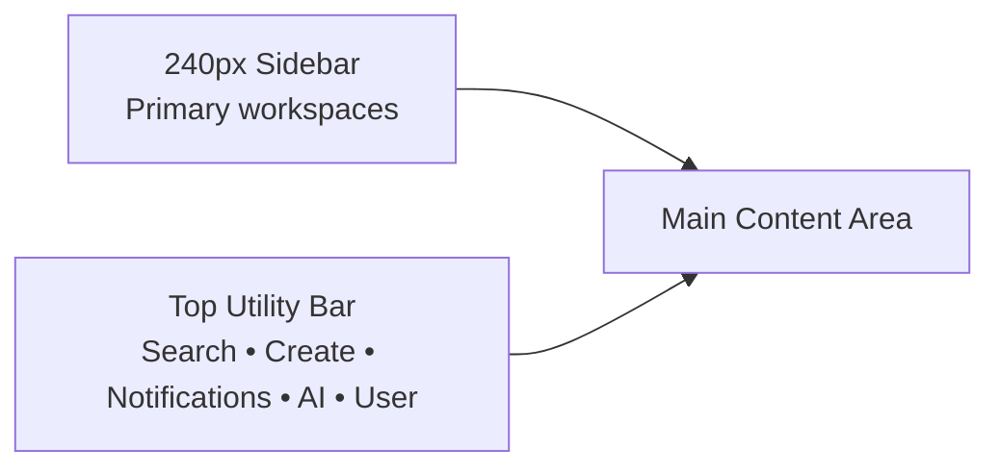
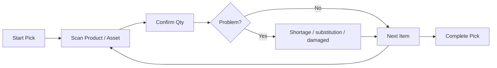
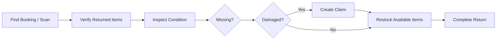
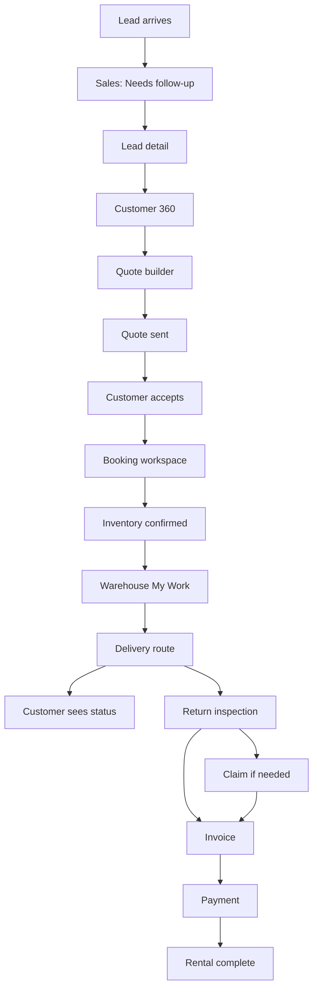

# RentFlow AI — High-Quality UX Design & Flow Blueprint

> **Purpose:** Redesign the current RentFlow AI user experience around clear role-based workflows, lower navigation complexity, faster task completion, stronger accessibility, and consistent SaaS interaction patterns.
>
> **Grounding:** Current Angular routes, dashboard navigation, quote and booking screens, customer portal surfaces, warehouse/delivery/returns modules, AI features, and the current modular-monolith architecture.
>
> **Target:** Production-quality B2B SaaS UX for desktop first, responsive tablet second, and task-focused mobile experiences for warehouse/driver/customer workflows.
>
> **Design principle:** Make the **next best action obvious**. RentFlow AI should feel like an operating system for rental work, not a collection of feature pages.

---

## 1. UX Executive Summary

RentFlow AI has strong feature depth, but the current navigation and page structure expose too much of the implementation history to the user.

The main UX challenge is **information overload**:

- The left navigation contains many sections and subitems at the same visual level.
- AI features occupy large, separate navigation areas instead of appearing contextually where work happens.
- Several workflows require users to understand internal module boundaries.
- Dashboard content is visually dense and includes many competing cards.
- Some views mix demo content, operational metrics, shortcuts, and AI briefing in one surface.
- Some routes and actions use inconsistent navigation paths.
- Dense tables rely heavily on visual scanning and icon-only actions.
- Future/disabled menu items are visible and add noise.
- Warehouse, delivery, inventory, finance, and CRM each behave like mini-products instead of one coherent rental workflow.

The redesign should organize the application around **five primary user jobs**:

1. **Sell** — leads, customers, requests, quotes
2. **Plan** — bookings, calendar, availability, inventory
3. **Fulfill** — warehouse, delivery, returns, claims
4. **Collect & Measure** — invoices, payments, analytics
5. **Configure** — team, integrations, automation, settings

AI becomes a **cross-cutting assistant**, not a separate product silo.

---

# 2. UX North Star

## Primary UX goal

A user should be able to answer these questions within 5–10 seconds after login:

- What needs my attention today?
- Which rentals are at risk?
- What should I do next?
- Where can I find the customer/booking/product I need?
- What has changed since I last checked?
- Can AI help me with this task without taking unsafe action?

## Product experience statement

> **RentFlow AI helps rental teams move every inquiry from lead to paid, fulfilled, returned booking with minimal operational friction.**

---

# 3. UX Principles

## 3.1 Workflow first, modules second

Users think:

> "I need to prepare tomorrow's deliveries."

They do not think:

> "I need the warehouse module, then delivery module, then calendar module."

Navigation and page flows should reflect business tasks.

## 3.2 Progressive disclosure

Show:
- the most important information first,
- details on demand,
- advanced controls only when needed.

Avoid placing every filter, KPI, AI feature, and action on the first screen.

## 3.3 One primary action per page

Each page should have one visually dominant action.

Examples:
- Quotes → **New Quote**
- Bookings → **Create / Convert Booking**
- Warehouse → **Start Picking**
- Returns → **Start Inspection**
- Customer → **Create Quote**
- Invoice → **Record / Request Payment**

Secondary actions belong in menus or lower-emphasis buttons.

## 3.4 AI is contextual

Instead of separate AI-heavy navigation, surface AI where relevant:

- Customer page → "Summarize account"
- Quote page → "Draft follow-up"
- Booking page → "Explain risk"
- Warehouse page → "Suggest substitution"
- Dashboard → "Ask RentFlow"
- Analytics → "Explain trend"

## 3.5 Status drives the UI

Rental software is state-heavy. Every list and detail page should make state immediately visible.

Examples:
- Draft
- Waiting for customer
- Deposit due
- Ready to pick
- Loaded
- Out for delivery
- On rent
- Return due
- Inspection required
- Claim open
- Payment overdue

## 3.6 Dense but calm

This is an operational SaaS product. It can contain a lot of information, but:
- spacing must be systematic,
- hierarchy must be obvious,
- color must communicate meaning rather than decoration,
- cards should be used sparingly.

---

# 4. Current UX Findings from the Repository

## 4.1 Sidebar navigation is too deep and feature-centric

The current dashboard navigation exposes many groups:

- CRM & Sales Pipeline
- AI Sales Agent
- AI Recommendations & Automation
- Phone AI Voice Center
- Operations
- Fulfillment
- Finance & Admin
- multiple nested entries

This creates a high cognitive load.

### Recommended change

Reduce the primary sidebar to **6 core destinations**:

1. Home
2. Sales
3. Rentals
4. Operations
5. Finance
6. Insights

Move configuration into a bottom **Settings** item.

Use contextual secondary navigation inside each workspace.

---

## 4.2 AI is overrepresented as navigation

Today AI Sales, Automation, Copilot, and Phone AI have large dedicated sections.

### Recommended change

Use a single top-level **AI Assistant** entry only if needed, but primarily expose AI contextually.

AI should help users complete existing business tasks, not force users to enter a separate AI product.

---

## 4.3 Dashboard is visually overloaded

Current dashboard content mixes:
- business profile,
- demo controls,
- shortcuts,
- pipeline metrics,
- upcoming rentals,
- AI briefing,
- multiple cards.

### Recommended change

Dashboard should focus on:

1. **Today**
2. **Needs attention**
3. **Upcoming work**
4. **Business health**
5. **Recent activity**

Everything else should be available via drill-down.

---

## 4.4 Tables need stronger task hierarchy

Current quote/booking tables include many columns and icon actions.

### Recommended change

Use:
- sticky header,
- persistent filters,
- saved views,
- row selection,
- one primary row click,
- "More" overflow for secondary actions,
- status chips,
- right-aligned currency,
- column visibility controls,
- density toggle,
- responsive fallback.

---

## 4.5 Route and interaction consistency

Some views navigate between dashboard-prefixed and non-dashboard paths. This can cause user disorientation and inconsistent breadcrumbs.

### Recommended change

Establish one canonical route hierarchy.

Example:

```text
/app
  /home
  /sales
  /rentals
  /operations
  /finance
  /insights
  /settings

/portal
/store
```

Route aliases can remain temporarily for backwards compatibility.

---

# 5. Recommended Information Architecture

## Desktop Sidebar

```text
RentFlow AI
│
├── Home
│
├── Sales
│   ├── Pipeline
│   ├── Leads
│   ├── Customers
│   ├── Rental Requests
│   └── Quotes
│
├── Rentals
│   ├── Bookings
│   ├── Calendar
│   ├── Availability
│   └── Inventory
│
├── Operations
│   ├── Today
│   ├── Warehouse
│   ├── Deliveries
│   ├── Returns
│   ├── Claims
│   └── Maintenance
│
├── Finance
│   ├── Invoices
│   ├── Payments
│   └── Receivables
│
├── Insights
│   ├── Executive
│   ├── Sales
│   ├── Utilization
│   ├── Profitability
│   └── Operations
│
└── Settings
    ├── Team & Roles
    ├── Integrations
    ├── Automation
    ├── AI & Phone
    ├── Business Profile
    └── API / Webhooks
```

## Global utility bar

Top-right utilities:

- Global Search
- Create (+)
- Notifications
- Ask RentFlow AI
- Help
- User / Company menu

---

# 6. Role-Based Navigation

## Owner / Admin

Primary:
- Home
- Sales
- Rentals
- Operations
- Finance
- Insights
- Settings

## Sales

Primary:
- Home
- Sales
- Rentals

Quick actions:
- New Lead
- New Customer
- New Quote

## Operations

Primary:
- Home
- Rentals
- Operations

Quick actions:
- View Today's Jobs
- Resolve Conflict
- Check Return

## Warehouse

Primary:
- Home
- Operations

Landing destination:
**My Work**

## Driver

Primary:
- Today
- Routes
- Deliveries

Mobile-first layout.

## Customer

Separate portal navigation:

```text
Home
My Events
Quotes
Bookings
Invoices
Requests
Messages
Profile
```

---

# 7. Global App Shell

## Desktop layout



### Shell rules

- Sidebar width: 240px expanded, 72px collapsed.
- Use icons + labels.
- No more than 7 top-level navigation items.
- Use section-level subnavigation inside page content.
- Top bar remains 56–64px high.
- Content max width: 1440–1600px for dense SaaS screens.
- Use 24px desktop page padding.
- Use 16px tablet page padding.

---

# 8. Home Dashboard Redesign

## Goal

Answer:
**What needs attention today?**

## Recommended layout

```text
┌─────────────────────────────────────────────────────────────┐
│ Good morning, Suresh                    [+ Create] [Ask AI]  │
│ Monday, Sep 28 • Evergreen Rentals                         │
├─────────────────────────────────────────────────────────────┤
│ NEEDS ATTENTION                                             │
│ 3 inventory conflicts | 2 deposits overdue | 1 late return │
├─────────────────────────────────────────────────────────────┤
│ TODAY                                                       │
│ 8 deliveries • 5 pickups • 12 warehouse jobs               │
├───────────────────────────────┬─────────────────────────────┤
│ Upcoming Rentals              │ Sales Pipeline              │
│ Timeline / compact list       │ Funnel + value              │
├───────────────────────────────┼─────────────────────────────┤
│ Operational Exceptions        │ Cash / Receivables          │
│ High priority issues          │ Due / Overdue / Collected   │
├─────────────────────────────────────────────────────────────┤
│ Recent Activity                                             │
└─────────────────────────────────────────────────────────────┘
```

### Dashboard KPI rules

Avoid 10+ KPI cards.

Use 4–6 meaningful KPIs maximum:

- Today's revenue
- Open pipeline
- Upcoming rental value
- Inventory conflicts
- Overdue receivables
- Open claims

### AI briefing

Replace a large decorative AI card with:

**Ask RentFlow**
> "Summarize today's risks"

Show 2–3 AI-generated actionable insights only when available.

---

# 9. Global Search / Command Palette

Shortcut:
**Ctrl / Cmd + K**

Search across:
- customers,
- leads,
- quotes,
- bookings,
- products,
- assets,
- invoices,
- claims.

## Results grouping

```text
Search "emily"

Customers
  Emily Brown
  Emily Events LLC

Bookings
  BKG-10231 — Emily Brown — Sep 20

Quotes
  QT-8921 — Emily Brown — $4,200
```

## Command actions

Also support:

- Create customer
- Create quote
- Record payment
- Open today's warehouse work
- Ask AI

This reduces dependence on navigation.

---

# 10. Sales Workspace UX

## Secondary navigation

```text
Pipeline | Leads | Customers | Requests | Quotes
```

## Sales Home

Should show:

- New inquiries
- Follow-ups due
- Quotes awaiting response
- Quotes expiring soon
- Conversion rate
- Pipeline value
- AI-assisted follow-up suggestions

---

# 11. Lead → Customer → Quote UX Flow

```mermaid
flowchart LR
    Inquiry["Inquiry / Lead"]
    Qualify["Qualify"]
    Customer["Create / Match Customer"]
    Request["Rental Requirements"]
    Availability["Check Availability"]
    Quote["Build Quote"]
    Send["Send to Customer"]
    Follow["Follow-up"]
    Accept["Accepted"]
    Booking["Convert to Booking"]

    Inquiry --> Qualify --> Customer --> Request --> Availability --> Quote --> Send --> Follow --> Accept --> Booking
```



## Lead detail page

Header:

```text
Emily Brown                              [Convert to Customer]
Wedding • Sep 20 • 250 guests
New inquiry • 12 minutes ago
```

Sections:
- Summary
- Requirements
- Activity
- Messages
- Recommended products
- Notes

Right rail:
- Next action
- Owner
- Follow-up date
- AI suggestions

---

# 12. Customer 360 UX

## Header

```text
Emily Brown
ABC Events • customer since 2025
[New Quote] [New Booking] [Message] [...]
```

## Tabs

- Overview
- Events
- Quotes
- Bookings
- Invoices
- Claims
- Activity

## Overview

Show:
- contact details,
- lifetime value,
- open balance,
- upcoming rental,
- current risks,
- recent activity.

Avoid showing every historical record at once.

---

# 13. Quote List Redesign

Current quote list has good status information but too many competing columns/actions.

## Recommended table

| Quote | Customer / Event | Dates | Value | Availability | Status | Updated | |
|---|---|---|---:|---|---|---|---|

Row click → quote detail.

Overflow menu:
- Edit
- Duplicate
- Preview
- Archive

## Filters

Persistent filter bar:

- Status
- Event date
- Availability
- Owner
- Value
- Search

Saved views:

- My Open Quotes
- Awaiting Customer
- Expiring Soon
- Accepted This Week

---

# 14. Quote Builder UX

Use a **step-based builder**, not one giant form.

```text
1 Customer
2 Event
3 Products
4 Pricing
5 Review
```

## Step 1 — Customer

- Search existing customer
- Quick-create inline
- Show warnings for duplicates

## Step 2 — Event

- Event date
- delivery / pickup
- location
- guest count
- notes

## Step 3 — Products

Split layout:

```text
┌───────────────────────────┬───────────────────────┐
│ Product Catalog           │ Quote Cart            │
│ Search                    │ Tent 20x20 x2         │
│ Filters                   │ Chairs x120           │
│ Availability badges       │ Tables x15            │
│ Suggested products        │                       │
└───────────────────────────┴───────────────────────┘
```

Show availability inline before adding.

## Step 4 — Pricing

- Rental subtotal
- fees
- delivery
- tax
- discount
- deposit
- margin indicator

## Step 5 — Review

Show customer-facing preview.

Primary action:
**Send Quote**

Secondary:
Save Draft

---

# 15. Booking List Redesign

Recommended columns:

| Booking | Customer / Event | Dates | Fulfillment | Payment | Status | |
|---|---|---|---|---|---|---|

Avoid separate Deposit + Balance columns in the default view.

Use a compact payment status:

- Paid
- Deposit due
- Balance due $1,240
- Overdue

Saved views:
- Today
- This Week
- Deposit Due
- Inventory Risk
- Ready for Fulfillment

---

# 16. Booking Detail — Single Operational Record

The booking detail page should be the **central operational workspace**.

## Page structure

```text
Booking #BKG-10231
Emily Brown • Wedding • Sep 20–21
Confirmed

[Collect Deposit] [Prepare Fulfillment] [...]

Tabs:
Overview | Items | Fulfillment | Delivery | Payments | Activity
```

## Overview

Show a lifecycle tracker:

```text
Quote ✓ → Confirmed ✓ → Pick → Load → Deliver → Return → Close
```

Then:

- event details,
- customer,
- rental window,
- address,
- payment summary,
- inventory exceptions,
- latest activity.

---

# 17. Calendar & Availability UX

## Default calendar

Use operational views:

- Month
- Week
- Timeline
- Inventory
- Driver
- Vehicle

## Conflict visualization

Avoid relying on red color alone.

Example:

```text
⚠ Shortage: White Folding Chair
120 requested / 96 available
24 units short
[View alternatives]
```

## Availability checker

Provide a standalone quick action:

**Check availability**

Inputs:
- date range,
- location,
- product/category,
- quantity.

Result:
- Available
- Limited
- Conflict

---

# 18. Inventory UX

## Inventory Workspace

Secondary navigation:

```text
Overview | Products | Assets | Availability | Reservations | Transfers | Counts
```

## Inventory overview

Focus on actionable status:

- Low stock
- Overbooked
- Maintenance
- Missing
- Transfers pending
- Count discrepancies

Avoid generic totals without an action.

## Product inventory detail

Header:

```text
White Folding Chair
SKU CHR-001
1,240 owned • 1,180 available

[Adjust Stock] [Transfer] [View Availability]
```

Tabs:
- Availability
- Assets
- Reservations
- History

---

# 19. Warehouse UX

Warehouse should be task-first, not menu-first.

## Default landing: My Work

```text
Today — Warehouse
────────────────────
Ready to Pick      8
In Progress        3
Ready to Pack      5
Exceptions         2

Priority Work
1. BKG-10231 Wedding — due 10:30 AM
2. BKG-10255 Corporate — due 11:00 AM
...
```

## Mobile picking flow



### Mobile UI principles

- 44px+ touch targets
- huge scan action
- minimal navigation
- progress indicator
- one item at a time
- offline/error feedback if later supported

---

# 20. Delivery / Driver UX

## Dispatcher desktop

Use three-pane approach:

```text
Routes / Drivers | Route Timeline / Map | Job Detail
```

Key information:
- delivery window,
- customer,
- address,
- items,
- load status,
- driver,
- vehicle,
- exceptions.

## Driver mobile

Bottom navigation:
- Today
- Route
- Messages
- Profile

Delivery step:

```text
ABC Events
10:30–11:00 AM
123 Main Street

[Start Navigation]

20 items • Loaded ✓

[Arrived]
```

Then:
- confirm handoff,
- notes,
- photo/signature if supported,
- complete delivery.

---

# 21. Returns UX

## Returns Home

Buckets:

- Due Today
- Arriving
- Inspection Required
- Exceptions
- Completed

## Return inspection flow



---

# 22. Damage Claim UX

Claim detail should answer:

- What happened?
- What item?
- Who reported it?
- Estimated cost?
- Customer responsibility?
- Evidence?
- Current decision?

## Claim states

```text
Reported → Reviewing → Estimate Ready → Customer Review → Resolved
```

Use timeline + evidence panel.

---

# 23. Finance UX

## Finance workspace

Secondary nav:

```text
Overview | Invoices | Payments | Receivables
```

## Finance Overview

Key metrics:

- Due today
- Overdue
- Collected this month
- Outstanding
- Failed payments

Main table:
**Needs Collection**

## Invoice detail

Header:
- invoice number,
- customer,
- amount due,
- due date,
- payment state.

Primary action:
**Collect / Record Payment**

Secondary:
- send reminder,
- download,
- adjust,
- refund where authorized.

---

# 24. Analytics UX

Analytics should be question-driven.

## Insights landing

Cards:

- How is revenue trending?
- Which products are most profitable?
- What inventory is underutilized?
- Which customers are most valuable?
- Where are operations failing?
- Which quotes are not converting?

## Chart rules

- Lines for trends
- Bars for comparisons
- Avoid pie charts with many categories
- Always show unit + timeframe
- Tooltips accessible by keyboard if practical
- Provide data tables for critical charts

---

# 25. AI UX Strategy

## One assistant, multiple contexts

Use the name:

**Ask RentFlow**

Entry points:
- global top bar,
- contextual inline prompt,
- selected-record actions.

## Example contextual AI actions

Customer:
- Summarize relationship
- Draft follow-up
- Identify open issues

Quote:
- Explain margin
- Draft customer message
- Suggest alternatives for shortage

Booking:
- Summarize fulfillment risk
- Draft delivery reminder

Analytics:
- Explain revenue drop
- Highlight unusual changes

## AI response pattern

```text
AI Insight
──────────────────────
3 bookings this weekend have inventory risk.

Why:
• 120 white chairs requested
• only 96 available
• 24-unit shortage

Suggested actions:
[View affected bookings]
[Find alternatives]

AI can recommend. You approve changes.
```

Never hide whether content is AI-generated.

---

# 26. Automation UX

Automation should live under Settings / Operations rather than dominate primary navigation.

## Automation home

- Active rules
- Pending approvals
- Recent executions
- Failed executions

## Approval card

```text
Suggested action
Send payment reminder to Emily Brown

Reason
Invoice #INV-10021 is 4 days overdue.

Impact
No financial state change.

[Approve] [Dismiss] [View Context]
```

Use explicit risk labels:
- Read-only
- Communication
- Operational change
- Financial change

---

# 27. Customer Storefront UX

The storefront should behave like rental commerce, not traditional ecommerce.

## Flow

```mermaid
flowchart LR
    Browse["Browse Catalog"]
    Dates["Choose Rental Dates"]
    Product["Product Detail"]
    Cart["Rental Cart"]
    Details["Event Details"]
    Availability["Availability Check"]
    QuoteCheckout["Request Quote / Checkout"]
    Confirmation["Confirmation"]

    Browse --> Dates --> Product --> Cart --> Details --> Availability --> QuoteCheckout --> Confirmation
```



## Catalog page

Top:
- rental dates,
- location,
- search.

Filters:
- category,
- price,
- availability,
- use case.

Product card:
- photo,
- name,
- rental price,
- availability,
- quantity selector,
- add.

## Product page

Show:
- images,
- rental rate,
- capacity/specifications,
- availability for selected dates,
- delivery notes,
- replacement/damage policy summary if relevant.

---

# 28. Rental Cart / Checkout UX

Rental checkout differs from retail.

## Sticky order summary

```text
Rental: Sep 20–21
Delivery: Sep 20, 8–10 AM
Return: Sep 21, 8–10 PM

Items      $2,800
Delivery     $250
Tax          $244
──────────────
Total      $3,294
Deposit      $988
```

Show total cost early.

Avoid hidden charges.

## Checkout steps

```text
1 Contact
2 Event
3 Delivery
4 Review
5 Deposit / Request
```

For complex B2B/event rentals, support:
- Request Quote
- Reserve / Checkout

based on business rules.

---

# 29. Customer Portal Redesign

## Portal home

```text
Welcome, Emily

Upcoming
Wedding Reception
Sep 20–21
Confirmed
[View Booking]

Action needed
Deposit of $988 due Sep 15
[Pay Deposit]

Recent
Quote QT-8921 accepted
Invoice INV-10022 issued
```

## Portal navigation

- Home
- Events
- Quotes
- Bookings
- Invoices
- Requests
- Messages
- Profile

Use plain customer language. Avoid internal operational terminology.

---

# 30. Forms & Validation Standards

## Form rules

- One-column forms by default.
- Labels above inputs.
- Never placeholder-only labels.
- Mark optional fields explicitly.
- Validate after blur or submit, not aggressively on every keystroke.
- Put errors next to the relevant field.
- Summarize errors at top for long forms.
- Preserve user input after errors.
- Use correct input types.
- Use sensible defaults.

## Example

Instead of:

```text
Event Date *
[____________]
Invalid.
```

Use:

```text
Event date
[ Sep 20, 2026 ]

This date overlaps with an existing booking for 24 chairs.
[View conflict]
```

---

# 31. Empty States

Every empty state should explain:
1. what this area is,
2. why it is empty,
3. what the user can do.

Example:

```text
No open quotes

Quotes waiting on customers will appear here.

[Create Quote]
```

Avoid decorative empty states with no action.

---

# 32. Loading & Error States

## Loading

Use:
- skeleton rows for tables,
- skeleton cards,
- button progress state.

Avoid blocking full-page spinners for partial updates.

## Errors

Error message structure:

```text
We couldn't save this booking.

Inventory changed while you were editing.
White Folding Chair is now short by 12 units.

[Review conflict] [Cancel]
```

Make errors recoverable.

---

# 33. Notifications

Use a unified notification center.

Categories:
- Needs action
- Updates
- System

Examples:
- Deposit overdue
- Warehouse shortage
- Delivery delayed
- Return overdue
- Automation approval
- Integration failure

Notification click should open the exact relevant record.

---

# 34. Status System

Use semantic status tokens consistently.

## Recommended semantic groups

### Neutral
- Draft
- Scheduled
- Pending

### Information
- Sent
- In Progress
- On Rent

### Success
- Confirmed
- Paid
- Completed

### Warning
- Deposit Due
- Inventory Risk
- Return Due

### Error
- Overdue
- Failed
- Conflict
- Cancelled

Never rely on color only. Always show text + optional icon.

---

# 35. Design System Foundations

## Spacing

8-point system:

```text
4, 8, 12, 16, 24, 32, 40, 48, 64
```

## Radius

```text
Small: 6px
Medium: 8px
Large: 12px
Panel: 16px
Pill: 999px
```

## Type hierarchy

```text
Page title       28–32 / 700
Section title    20–24 / 650–700
Card title       16–18 / 600
Body             14–16 / 400
Small            12–13 / 400–500
Table header     12–13 / 600
```

## Layout

- 12-column desktop
- 8-column tablet
- 4-column mobile
- 24px desktop gutters
- 16px mobile gutters

---

# 36. Component Library

Required shared Angular components:

## Navigation
- AppShell
- Sidebar
- WorkspaceTabs
- Breadcrumb
- CommandPalette

## Actions
- Button
- IconButton
- SplitButton
- OverflowMenu

## Inputs
- TextInput
- SearchInput
- Select
- Combobox
- DateRangePicker
- CurrencyInput
- QuantityInput

## Feedback
- Alert
- Toast
- InlineError
- EmptyState
- Skeleton
- Progress

## Data
- DataTable
- FilterBar
- SavedView
- Pagination
- StatusBadge
- Metric
- Timeline
- ActivityFeed

## Business components
- CustomerSummary
- BookingLifecycle
- PaymentStatus
- AvailabilityBadge
- InventoryConflict
- FulfillmentProgress
- AIInsight

---

# 37. Accessibility Requirements — WCAG 2.2 AA Target

## Minimum requirements

- Body text contrast ≥ 4.5:1.
- Large text/UI components ≥ 3:1.
- Do not use color alone for status.
- All controls keyboard-accessible.
- Visible focus ring.
- Semantic heading order.
- Form inputs have visible labels.
- Icon-only buttons have accessible names.
- Tables include proper headers.
- Dialog focus is trapped and returned on close.
- Touch targets at least 24px, recommended 44px.
- Respect `prefers-reduced-motion`.
- Support 200% text zoom without loss of function.
- Avoid hover-only essential interactions.

A full accessibility audit still requires keyboard and assistive-technology testing.

---

# 38. Responsive Strategy

## Desktop ≥ 1200px

- Full sidebar
- Wide tables
- 2–3 column detail layouts

## Tablet 768–1199px

- Collapsible sidebar
- reduced table columns
- drawers for detail panels

## Mobile < 768px

Do not shrink desktop tables.

Use:
- cards,
- task lists,
- bottom sheets,
- sticky primary actions,
- bottom navigation for driver/warehouse/customer workflows.

---

# 39. Recommended Role-Specific Home Screens

## Sales

```text
My follow-ups
New inquiries
Quotes awaiting response
Expiring quotes
Pipeline
```

## Warehouse

```text
My work
Ready to pick
Pack queue
Exceptions
Load deadlines
```

## Operations

```text
Today's rentals
Conflicts
Delivery status
Returns due
Claims
```

## Finance

```text
Due today
Overdue
Failed payments
Recent collections
```

## Owner

```text
Business health
Exceptions
Revenue
Utilization
Pipeline
Receivables
```

---

# 40. End-to-End UX Flow — Sales to Completion



---

# 41. High-Priority UX Improvements

## P0 — Navigation & consistency

1. Replace the current long sidebar with workspace-level navigation.
2. Introduce canonical route structure.
3. Remove disabled/future items from primary navigation.
4. Add global search / command palette.
5. Add consistent page header and breadcrumbs.
6. Standardize primary/secondary/overflow actions.

## P1 — Core revenue workflow

1. Redesign Sales workspace.
2. Redesign Customer 360.
3. Make Quote Builder a guided step flow.
4. Redesign Booking Detail as the central lifecycle workspace.
5. Add saved list views and better filter bars.

## P1 — Operations

1. Warehouse My Work becomes default.
2. Add task-first mobile picking.
3. Add Operations Today screen.
4. Unify returns + inspection + claims flow.
5. Improve delivery dispatcher + driver mobile experience.

## P2 — Customer experience

1. Redesign storefront around rental dates first.
2. Simplify quote/checkout steps.
3. Redesign portal Home around upcoming rental + actions due.
4. Improve messages and status visibility.

## P2 — AI

1. Create one "Ask RentFlow" interaction model.
2. Embed AI actions contextually.
3. Move automation configuration to Settings.
4. Keep AI recommendations explainable and approval-based.

---

# 42. Suggested UX Implementation Roadmap

## UX Phase 1 — Foundation

- App shell
- Sidebar IA
- Page header
- Breadcrumbs
- Buttons
- inputs
- status badges
- tables
- filter bar
- empty/loading/error states
- accessibility baseline

## UX Phase 2 — Sales

- Sales home
- Lead detail
- Customer 360
- Quotes list
- Quote builder
- Quote detail

## UX Phase 3 — Rentals

- Booking list
- Booking detail
- Availability checker
- Calendar
- inventory views

## UX Phase 4 — Operations

- Operations Today
- Warehouse My Work
- Picking/packing/loading
- Delivery dispatcher
- Driver mobile
- Returns
- Claims

## UX Phase 5 — Finance & Insights

- Finance overview
- Invoices
- payments
- analytics

## UX Phase 6 — Storefront & Portal

- Catalog
- product
- cart
- checkout / quote request
- portal Home
- portal bookings/invoices/messages

## UX Phase 7 — AI & Automation

- Ask RentFlow
- contextual AI actions
- automation approvals
- AI settings
- phone AI configuration

---

# 43. Recommended Angular UX Architecture

```text
frontend/src/app/
├── core/
│   ├── layout/
│   ├── navigation/
│   ├── auth/
│   └── services/
│
├── shared/
│   ├── ui/
│   │   ├── button/
│   │   ├── badge/
│   │   ├── table/
│   │   ├── filter-bar/
│   │   ├── empty-state/
│   │   ├── skeleton/
│   │   └── modal/
│   └── business/
│       ├── customer-summary/
│       ├── payment-status/
│       ├── availability/
│       └── booking-lifecycle/
│
├── features/
│   ├── sales/
│   ├── rentals/
│   ├── operations/
│   ├── finance/
│   ├── insights/
│   ├── settings/
│   └── ai/
│
├── portal/
└── storefront/
```

This is a **frontend organization recommendation**, not a requirement to reorganize everything immediately.

Migrate incrementally as screens are redesigned.

---

# 44. UX Design Acceptance Criteria

A redesigned screen should not be considered complete unless:

- [ ] The page has one clear primary purpose.
- [ ] The primary action is obvious.
- [ ] Navigation location is clear.
- [ ] All status information includes text, not color alone.
- [ ] Keyboard users can access every action.
- [ ] Loading, empty, error, and success states exist.
- [ ] Mobile behavior is explicitly designed.
- [ ] Tenant/permission-restricted actions do not appear when unavailable.
- [ ] Tables support search/filter/pagination where appropriate.
- [ ] Money/date formats are consistent.
- [ ] Destructive actions require appropriate confirmation.
- [ ] AI-generated content is labeled.
- [ ] AI cannot silently execute high-impact actions.
- [ ] User input survives recoverable errors.
- [ ] Screen works at 200% text zoom without essential content loss.

---

# 45. UX Success Metrics

Track after redesign:

## Sales

- Time from inquiry → first quote
- Quote completion rate
- Quote acceptance rate
- follow-up completion
- average clicks to create quote

## Operations

- time to complete pick
- shortage resolution time
- on-time delivery rate
- return inspection time
- number of unresolved exceptions

## Customer

- quote view → acceptance
- checkout/request completion rate
- portal task completion
- support contacts per booking

## Usability

- time to find a booking/customer
- global-search usage
- navigation errors/backtracking
- form validation errors
- task completion time
- accessibility issue count

---

# 46. Tree-Test Plan for Navigation

Before finalizing the new IA, test users with tasks:

1. Where would you go to create a quote?
2. Where would you check whether 120 chairs are available next weekend?
3. Where would you see jobs warehouse staff need to pick today?
4. Where would you record a return?
5. Where would you see overdue invoices?
6. Where would you configure an integration?
7. Where would you review an AI recommendation requiring approval?

Target:
**≥ 85% first-click success** for common tasks.

---

# 47. Recommended First UX Development Sprint

The strongest first implementation should be:

## Sprint UX-01 — App Shell + Sales/Rentals Navigation

Deliver:

1. New simplified sidebar
2. Global utility header
3. Breadcrumb/page header
4. command palette shell
5. shared Button / Badge / Empty State / Table / Filter Bar
6. Sales workspace navigation
7. Rentals workspace navigation
8. redesigned Quotes List
9. redesigned Bookings List
10. accessibility keyboard/focus baseline

### Why start here?

These elements create a reusable foundation and immediately reduce the biggest current problem: navigation and screen inconsistency.

---

# 48. Final UX Direction

The new RentFlow AI UX should feel like this:

> **Calm operational control, with AI quietly helping in context.**

The interface should guide each role through the rental lifecycle instead of exposing every backend module equally.

The core experience becomes:

```text
Home
  ↓
Sales
Lead → Customer → Quote
  ↓
Rentals
Booking → Availability → Calendar
  ↓
Operations
Pick → Load → Deliver → Return → Claim
  ↓
Finance
Invoice → Payment
  ↓
Insights
Revenue • Utilization • Profitability

Ask RentFlow AI is available across all stages.
```

This UX direction preserves the current feature investment while making the product substantially easier to learn, faster to operate, and safer to scale.
